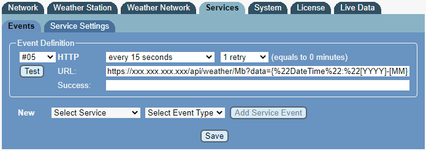
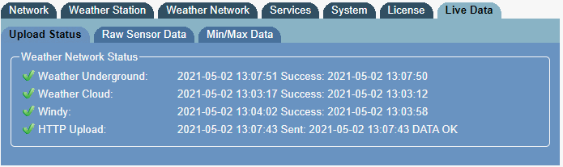

# Weather-Unified

A modern weather dashboard application for weather station owners, providing real-time data visualization and historical weather tracking.

This application is designed for [Meteobridge](https://www.meteobridge.com/) users, offering a comprehensive dashboard for your weather station that can be hosted locally on your network or over the internet.

## Features

- **Modern .NET 8.0 Framework** - Built with the latest .NET technology for optimal performance
- **WURequest API** - RESTful API for collecting data from Meteobridge devices into MongoDB database
- **WUCharts** - Interactive weather data visualization with responsive charts
- **Modern Asset Bundling** - Uses WebOptimizer for efficient CSS/JS bundling and minification
- **Docker Support** - Containerized deployment with .NET 8.0 Docker images
- **Comprehensive Testing** - Full test suite covering both WUCharts and WURequest endpoints
  - Unit tests for core functionality verification
  - Integration tests verifying endpoint functionality
  - Bundler tests validating asset optimization
  - Service layer mocking and validation
- **MongoDB Integration** - Efficient data storage and retrieval
- **Weather Underground Integration** - Forecast data for contributors

## Technology Stack

- **.NET 8.0** - Latest LTS version of .NET
- **ASP.NET Core** - Web framework for APIs and web applications
- **MongoDB** - Document database for weather data storage
- **WebOptimizer** - Modern bundling and minification
- **Docker** - Containerization support
- **Bulma CSS** - Modern CSS framework for responsive design
- **amCharts** - Interactive charting library

## Recent Updates (2025)

### Modernization Complete
- **Upgraded from .NET Core 2.1 to .NET 8.0** - Latest LTS version with improved performance
- **Replaced Legacy Bundler** - Migrated from BundlerMinifier to WebOptimizer for modern asset management
- **Updated Docker Images** - Now using official .NET 8.0 Docker images
- **Updated Publish Profiles** - Modernized for .NET 8.0 deployment
- **Comprehensive Testing** - Added 16 tests covering all functionality including bundler verification
- **Improved Build Process** - Streamlined build and deployment pipeline

## Getting Started

### Prerequisites
- .NET 8.0 SDK
- MongoDB (local or cloud instance)
- Docker (optional, for containerized deployment)

### Installation

1. **Clone the repository**
   ```bash
   git clone https://github.com/Psynosaur/Weather-Unified.git
   cd Weather-Unified
   ```

2. **Build the solution**
   ```bash
   dotnet build
   ```

3. **Configure MongoDB connection**
   - Update connection strings in `appsettings.json` files
   - The WURequest API will create the first observation document automatically

4. **Run the applications**
   ```bash
   # Start the API (WURequest)
   cd WURequest
   dotnet run
   
   # Start the web dashboard (WUCharts) - in a new terminal
   cd WUCharts
   dotnet run
   ```

### Docker Deployment

```bash
# Build and run WURequest API
cd WURequest
docker build -t weather-unified-api .
docker run -p 5000:80 weather-unified-api

# WUCharts can be deployed similarly (Dockerfile needed)
```

## Testing

Run the comprehensive test suite:

```bash
# Run all tests (16 tests total)
dotnet test

# Run specific test categories
dotnet test --filter "ObservationsController"  # Controller tests
dotnet test --filter "WeatherController"       # Weather API tests
dotnet test --filter "Bundler"                 # WebOptimizer bundler tests

# Run from test project directory
cd WUTests
dotnet test
```

### Test Coverage

The project includes comprehensive testing with **16 total tests**:

- **Controller Tests (4)**: ObservationsController endpoint testing
- **API Tests (5)**: WeatherController and Meteobridge integration testing  
- **Bundler Tests (7)**: WebOptimizer configuration and functionality testing

All tests are passing and cover:
-  Unit tests for core functionality verification
-  Integration tests verifying endpoint functionality
-  Bundler tests validating asset optimization
-  Service layer mocking and validation

### Bundler Verification

The WebOptimizer bundler has been thoroughly tested and verified:

- **CSS Bundle**: `/css/site.min.css` - Combines Bulma, tooltips, Flatpickr, and site CSS
- **JavaScript Bundle**: `/js/site.min.js` - Combines core, charts, dark theme, Flatpickr, and site JS
- **Source File Validation**: All source files exist and are properly configured
- **Service Registration**: WebOptimizer is correctly registered in the DI container
- **Content Type Handling**: Proper MIME types are assigned to bundles

## Configuration

### Meteobridge Setup

Configure your Meteobridge device to send data to the WURequest API using the following HTTP GET request format:

#### HTTP GET Request String

Replace `xxx.xxx.xxx.xxx` with your server's IP address:

```
https://xxx.xxx.xxx.xxx/api/weather/Mb?obsTime=[YYYY]-[MM]-[DD]T[hh]:[mm]:[ss].000%2B02:00&tempOutCur=[th0temp-act]&tmin=[th0temp-min2]&tmax=[th0temp-max2]&humOutCur=[th0hum-act]&pressCur=[thb0seapress-act]&dewCur=[th0dew-act]&heatIdxCur=[th0heatindex-act]&windChillCur=[wind0chill-act]&tempInCur=[thb0temp-act]&humInCur=[thb0hum-act]&windSpeedCur=[wind0wind-act]&windAvgSpeedCur=[wind0avgwind-act]&windDirCur=[wind0dir-act]&windDirCurEng=[wind0dir-act=endir]&windGust10=[wind0wind-max10]&windDirAvg10=[wind0dir-avg10]&windDirAvg10Eng=[wind0dir-avg10=endir]&rainRateCur=[rain0rate-act]&rainDay=[rain0total-daysum]&rainYest=[rain0total-ydaysum=]&rainMonth=[rain0total-monthsum]&rainYear=[rain0total-yearsum]&uv=[uv0index-act]&solarRad=[sol0rad-act]
```

#### Time Zone Configuration

- `%2B02:00` represents **UTC +2** hours
- For negative time zones, replace `%2B` with `%2D`
- Adjust the timezone offset according to your location

This configuration string is built using [Meteobridge Templates](https://www.meteobridge.com/wiki/index.php/Templates).

### Weather Underground Forecasts

If you're a Weather Underground contributor, you can enable forecast data by configuring your API credentials in the application settings.

## Verification

### Check Meteobridge Integration

1. **Services Events Page** - Verify HTTP upload status
   

2. **Live Data Page** - Confirm data reception
   

Look for **"Data OK"** status in the HTTP Upload section.

## Project Structure

```
Weather-Unified/
├── WURequest/          # API project for data collection
├── WUCharts/           # Web dashboard for data visualization
├── WUTests/            # Test projects
├── README.md           # This file
└── WeatherUnified.sln  # Solution file
```

## Publishing

Both projects include updated publish profiles for .NET 8.0:

```bash
# Publish WURequest API
cd WURequest
dotnet publish -p:PublishProfile=FolderProfile

# Publish WUCharts Dashboard
cd WUCharts
dotnet publish -p:PublishProfile=FolderProfile
```

## Contributing

1. Fork the repository
2. Create a feature branch
3. Make your changes
4. Add tests for new functionality
5. Ensure all tests pass (`dotnet test`)
6. Submit a pull request

## License

This project is licensed under the MIT License - see the [LICENSE](LICENSE) file for details.

## Support

For issues and questions:
- Create an issue on GitHub
- Check the [Meteobridge documentation](https://www.meteobridge.com/wiki/) for device-specific setup

---

**Note**: This application has been fully modernized to use .NET 8.0 and current best practices for web development and deployment. All legacy components have been updated and thoroughly tested.
